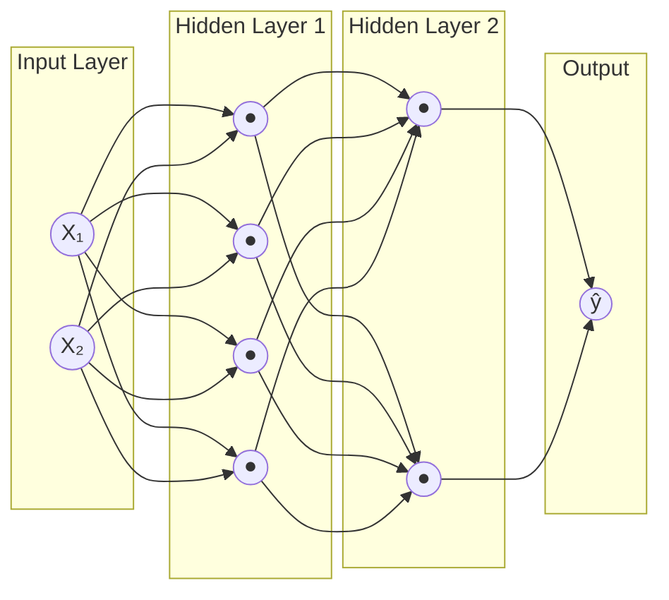
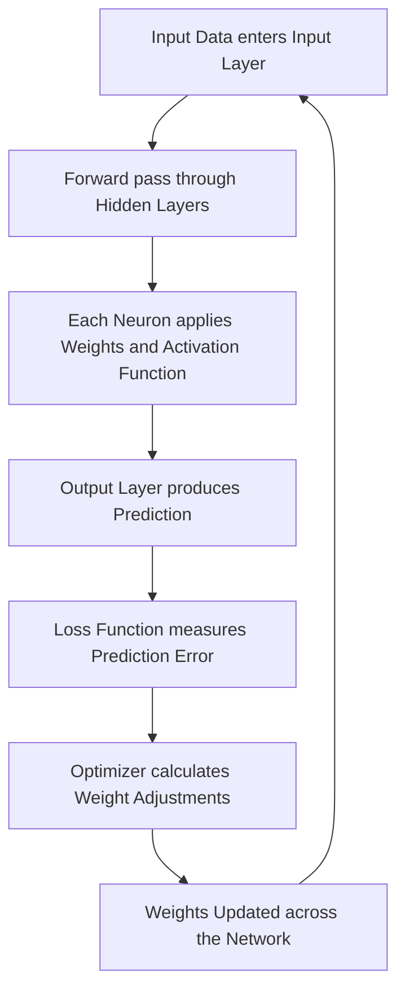

# A Visual Field Guide to Neural Networks
🔗 **Live infographic:** [View it here](https://nicoolesy.github.io/neural-network-components/index.html)

> A hands-on exploration of how neural networks work, built using the TensorFlow Neural Network Playground.
**Tool:** [TensorFlow Neural Network Playground](https://playground.tensorflow.org/)

---

## Table of Contents

1. [Introduction](#introduction)
2. [Network Architecture](#network-architecture)
3. [The Six Core Components](#the-six-core-components)
4. [How It All Works Together](#how-it-all-works-together)
5. [Summary and Key Insights](#summary-and-key-insights)

---

## Introduction

Neural networks power nearly every modern AI system — image recognition, language translation, recommendation engines, and large language models like ChatGPT. Despite the complexity of their applications, the underlying structure is built from a small number of simple, well-defined components working together.

This guide defines those components, illustrates how they connect, and documents experiments using the TensorFlow Neural Network Playground — an interactive browser tool that visualizes a neural network learning in real time. Each experiment shows a different component's effect on training, with the goal of turning abstract definitions into hands-on intuition.

---

## Network Architecture

The diagram below shows how data flows through a neural network from input to output. This is the same structure visualized in the Playground.



**Reading the diagram:**
- Each **circle** is a neuron
- Each **arrow** is a weighted connection
- Data flows left to right: input features → hidden layers → output prediction
- In the Playground, the **thickness** of each line shows how strong each weight is, and **color** shows whether the weight is positive (blue) or negative (orange)

---

## The Six Core Components

### 1. Layers

Layers are stacked groups of neurons that process data sequentially.

| Layer Type | Purpose | Where in the Playground |
|------------|---------|--------------------------|
| **Input Layer** | Receives raw data (one neuron per feature) | The "FEATURES" column on the left (X₁, X₂, etc.) |
| **Hidden Layers** | Transform data through learned patterns | The middle columns labeled "HIDDEN LAYERS" |
| **Output Layer** | Produces the final prediction | The decision boundary visualization on the right |

The number of hidden layers defines a network's *depth*. In the Playground, you can add or remove hidden layers using the **+** and **−** buttons above the network. "Deep learning" simply means using networks with many hidden layers.

### 2. Neurons

A neuron is the basic computational unit. Each one performs a simple calculation:

```
output = activation(w₁·x₁ + w₂·x₂ + ... + wₙ·xₙ + bias)
```

In plain English: the neuron takes its inputs, multiplies each by a weight, sums them up (with a bias offset), and passes the result through an activation function. **In the Playground, you can hover over any neuron in a hidden layer to see exactly what pattern it has learned to detect** — some neurons learn to detect curves, others learn diagonal lines, others learn corners. A single neuron is barely useful on its own, but combine thousands of them and they collectively learn to recognize complex patterns.

### 3. Weights

Weights are numerical values that determine how strongly each input influences a neuron's output. **They are where the network's knowledge actually lives.**

In the Playground, weights are shown as the **lines connecting neurons**:
- **Thickness** = magnitude of the weight (thicker = more influence)
- **Color** = sign of the weight (blue = positive, orange = negative)

Training a neural network is the process of nudging thousands or millions of weights up or down until predictions match reality. When people say "the model has learned," what they really mean is "the weights have settled into useful values."

### 4. Activation Functions

Activation functions introduce **non-linearity** into the network, allowing it to learn curved, complex patterns instead of straight lines.

| Function | Output Range | Best For |
|----------|--------------|----------|
| **ReLU** | 0 to ∞ | Default for hidden layers (fast, effective) |
| **Tanh** | −1 to 1 | Hidden layers when negative outputs help |
| **Sigmoid** | 0 to 1 | Binary classification output |
| **Linear** | −∞ to ∞ | Regression output only |

In the Playground, the activation function is set in the **top bar dropdown**. The default is Tanh. **Without non-linear activation functions, even a 100-layer network could only learn straight-line relationships.** I confirmed this experimentally — see Experiment 2 below.

### 5. Loss Functions

A loss function measures how wrong the network's current predictions are. Lower loss = better predictions.

- **Mean Squared Error (MSE)** — for regression (predicting numbers)
- **Cross-Entropy Loss** — for classification (predicting categories)

In the Playground, the current loss is displayed in the top-right of the OUTPUT panel as **"Training loss"** and **"Test loss."** Watching these numbers shrink as training progresses is watching the optimizer in action. The loss function is the network's report card — it doesn't fix anything on its own, but it tells the optimizer what needs improvement.

### 6. Optimization Algorithms

Optimizers adjust the weights to reduce the loss. The foundational technique is **gradient descent**: calculate which direction each weight should move to reduce loss, then nudge it slightly that way. Repeat thousands of times.

In the Playground, the **Learning rate** dropdown in the top bar controls how big each weight adjustment is per step. The **Epoch counter** shows how many training iterations have run. Each time you press play, the optimizer runs gradient descent automatically, and you can literally watch the decision boundary form in real time.

Common modern optimizers:
- **SGD** (Stochastic Gradient Descent) — the classic
- **Adam** — adaptive, fast, the most popular choice today
- **RMSprop** — good for recurrent networks

This is the "learning" in machine learning.

---

## How It All Works Together

Here's what happens during one training step, showing how all six components interact:



This cycle repeats once per **epoch** (visible in the Playground's epoch counter). After thousands of cycles, the weights settle into values that produce accurate predictions, and the decision boundary visibly forms around the data clusters.

---

## Summary and Key Insights

Neural networks are often described as "black boxes," but visualizing their structure in tools like the Playground makes them dramatically more understandable. Key insights from this exercise:

 **Structure is simpler than it sounds.** A neural network is just neurons organized into layers, connected by weights (repeated as needed).

 **Learning is weight adjustment.** The mystery of "how AI learns" reduces to a clear process: measure error, nudge weights, repeat.

 **Non-linearity is everything.** Without activation functions, depth is meaningless. This was the single most important thing I learned from the Playground.

 **Hyperparameters matter as much as architecture.** Learning rate, activation choice, and noise level affected training outcomes as much as the number of layers.

 **Visualization beats explanation.** Watching decision boundaries form in real time turned textbook definitions into genuine intuition. Reading "the network learns weights" is abstract; seeing the lines between neurons thicken and change color as training runs is concrete.

These foundations underpin every modern AI system, including the word embeddings explored in my previous artifact, which are themselves the learned weights of a neural network's hidden layer.

---

## References

- TensorFlow Neural Network Playground: https://playground.tensorflow.org/
- 3Blue1Brown — *But what is a neural network?*: https://www.youtube.com/watch?v=aircAruvnKk
- TensorFlow Documentation: https://www.tensorflow.org/

---

*This artifact was created as part of Model Development at Indiana Wesleyan University.*
